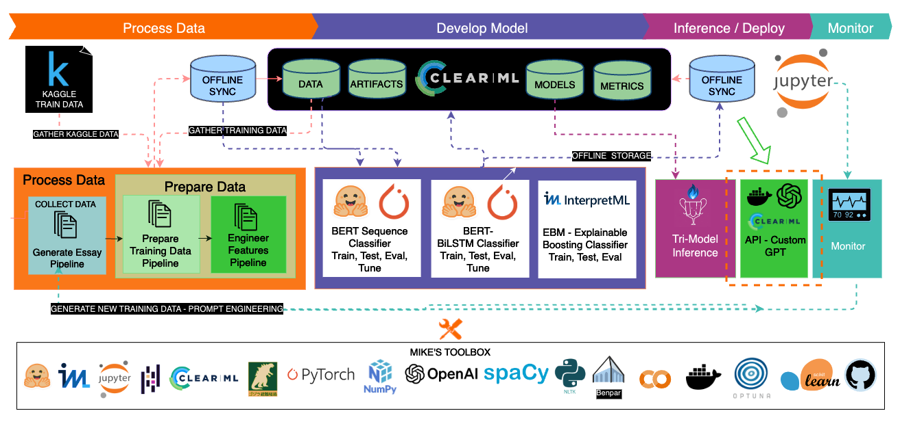
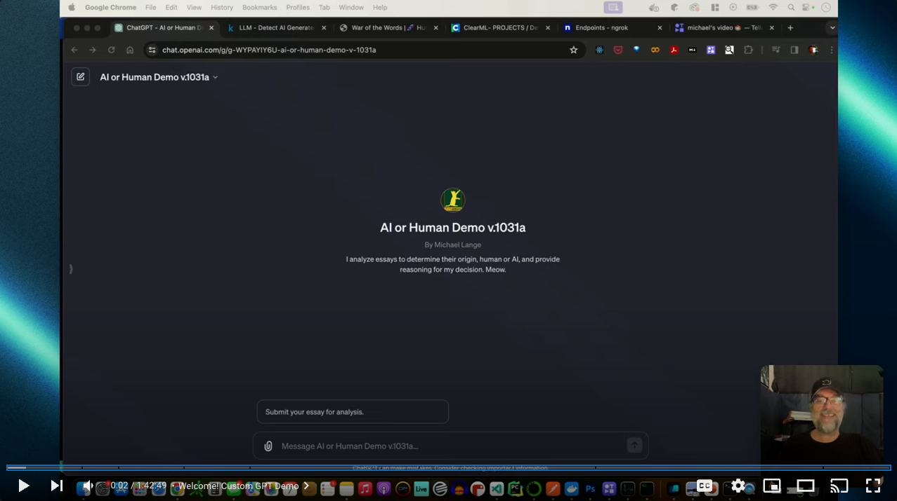

### This is a fork of [ClearML Serving](https://github.com/allegroai/clearml-serving)

**ClearML Serving - Model deployment made easy**

> &#10039; This project does not touch the code in the clearml_serving directory. However, due to its awesomeness and tight integration with this demo, it was pertinant to bring along for the ride. Enjoy!

## Inspired by:

#### LLM - Detect AI Generated Text
*Identify which essay was written by a large language model*

 

# 🅰👁️ | 🧬  

## Architecture

## Watch and Code Along.

### [Mike Lange Description]
 
Um. Ok. Well. This is a step by step guide to building and deploying your own Custom GPT and API with End to End ClearML integration. Fun stuff.

### [GPT 4 Description]
 

Embark on a comprehensive journey to create, deploy, and leverage your very own Custom GPT and API, fully integrated with ClearML for a seamless experience. 

This step-by-step tutorial takes you through the entire process, starting with the construction of a robust PyTorch model that combines the prowess of a ``BERT/BiLSTM`` with the interpretability of an ``Explainable Boosting Machine`` (EBM) from InterpretML.

Discover how to bring your API to life using the power of ``HuggingFace``, ``PyTorch``, ``ClearML``, ``ClearML-Serving``, ``Docker``, ``NVIDIA Triton Inference``, and more ensuring your model is not just a marvel of machine learning but also a fully operational service. Dive into the world of custom GPT actions, designing a system that communicates effectively with your API, and explore the innovative concept of ``Retrieval Augmented Generation`` (RAG) to enhance your GPT's responses with real-time, llm based enhanced explainability.

Whether you're a seasoned data scientist or an enthusiastic beginner &#9996;, this guide promises to equip you with the knowledge and tools needed to bring your AI visions to reality.

Wow, right? 

&#9996; That last part may be off. This is not easy stuff. You will work at getting it all going if you wish to recreate it. But just dive into the areas that are new to you, and kick its ass.  

### &#9851; &#8594; [Setup Your Environment](presentation/Setup.md) 
### 🚄 &#8594; [Train and Publish Model ](presentation/Train_Publish_Model.md) 

### 🏗 &#8594; [Deploy Infrastructure](presentation/Infrastructure_clearml-serving.md) 

### 😻 &#8594; [Build API](presentation/Build_Deploy_API.md) 

### 🪠 &#8594; [Tie it all together with a Custom GPT](presentation/Build_GPT.md)

### 😂 &#8594; [Have a Laugh](https://www.lifehack.org/articles/lifestyle/30-ways-add-fun-your-daily-routine.html)

#### 🤟 If your organization is looking for someone with my skillset, I am available as of 2-9-2024. Send me a message or check out my resume at [http://www.mikelange.com](mikelange.com) I look forward to chatting!
 
## Technology Thank You! 
&#8594; Hugging Face: https://huggingface.co/  
&#8594; Interpret ML: https://interpret.ml/
&#8594; ClearML: https://clear.ml/  
&#8594; Thanks ``Victor`` For the awesome Vids!  
&#8594; PyTorch: https://PyTorch.org  
&#8594; OpenAI: https://openai.com   
&#8594; Docker: https://docker.com   
&#8594; NVIDIA: https://nvidia.com  
&#8594; Anaconda https://anaconda.org/  
&#8594; Github  @GitHub 
