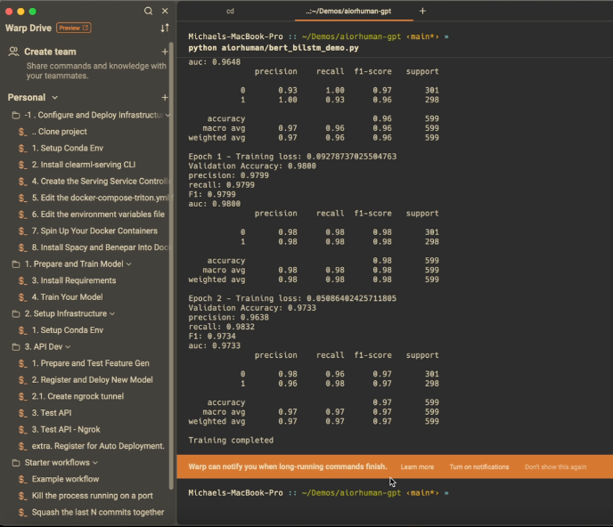

## &#8592;[Back](../README.md)

# Build and Deploy API
### Model is Good to Go
<p align="center">
  
  <br>
</p>

## Quick Review 
- Go to clearml webui and expore, model, metrics, publishing. 
- Review infrastructre diagram again. 

## Setup API and Inference
### Head back to your project and look at 'aiorhuman/preprocess.py' 

Impliment these. 
```python
class Preprocess(object):
    def __init__(self):
        self.model = BERTBiLSTMClassifier(
            bert_model_name='bert-base-uncased',
            num_classes=2,
            dropout_rate=0.1,
            lstm_hidden_size=128,
            lstm_layers=2
        )
        self.model.load_state_dict(torch.load('bert_bilstm_model.pt'))  # Load your trained model weights - this is pulled from clearml artifact storage (anywhere, aws, drive)
        self.model.eval()  # Set the model to evaluation mode
        self.tokenizer = BertTokenizer.from_pretrained('bert-base-uncased')
        self.max_length = 128

    def preprocess(self, body: Union[bytes, dict], state: dict, collect_custom_statistics_fn: Optional[Callable[[dict], None]]) -> Any:

    def process(self, data: Any, state: dict, collect_custom_statistics_fn: Optional[Callable[[dict], None]]) -> Any:

    def postprocess(self, data: Any, state: dict, collect_custom_statistics_fn: Optional[Callable[[dict], None]]) -> dict:
  
```

### Test the feature generation.
Run: 
```bash
python aiorhuman/tests/features.py
```

## Deploy Inference and Orchistrate Model. 
Make sure you put in your proper -id and model-id from your clearml-server
```sh
clearml-serving --id db2a93a7d21042f0a81c075747edbd74 model add \
--engine triton --endpoint "bert_infer_demo" \
--preprocess "aiorhuman-gpt/aiorhuman/preprocess.py" \
--model-id 6cca54290c5d426dbcc088201274656e \
--input-size 1 128 \
--input-name "input_ids" \
--input-type float32 \
--output-size -1 2 \
--output-name "output" \
--output-type float32 \
--tags "bert-infer-add"
```

**OR (explain auto publishing and canary deployments)**

```sh
clearml-serving --id 57187db30bfa46f5876ea198f3e46ecb model auto-update 
--engine triton --endpoint "bert_infer_demo" \
--preprocess "aiorhuman-gpt/aiorhuman/preprocess.py" \ 
--model-id 6cca54290c5d426dbcc088201274656e \
--input-size 1 128 \
--input-name "input_ids" \
--input-type float32 \
--output-size -1 2 \
--output-name "output" \
--output-type float32 \
--tags "bert_infer-add" \
--max-versions 2 \
--tags "bert-infer-autoupdate"
```

**Have on Deck**
```sh
clearml-serving model remove -h --endpoint 'bert_infer_demo'
```

## Wait 5 Min
really. don't get impatient when you do the above. it takes a hot minute to refresh. 

---
## Install ngrok if you have not! GPTs will not run localhost. 
- https://ngrok.com/ and create a tunnel to your local machine inference server. you'll need this to work with custom GPT actions 
```shell
ngrok config add-authtoken <TOKEN>
ngrok http http://localhost:8080
```
---

## Test your api. 
1. Update your test files with service ids 
```sh
python aiorhuman/tests/api.py
``` 
2. In code
```python
import requests
import json

def test_model(text, endpoint_url):
    # Prepare the request payload
    payload = json.dumps({
        "text": text
    })
    # Send a POST request to the model endpoint
    response = requests.post(endpoint_url, data=payload, headers={'Content-Type': 'application/json'})

    # Parse the response
    if response.status_code == 200:
        print("Response from model:", response.json())
    else:
        print("Failed to get response, status code:", response.status_code)

# Example usage
text_sample = "As the education landscape continues to evolve, the debate over the benefits of students attending school from home has become increasingly relevant."
model_endpoint_url = "https://4435-173-31-239-51.ngrok-free.app/serve/bert_infer"

test_model(text_sample, model_endpoint_url)
```

3. Curl 
```curl
curl -X POST "https://4435-173-31-239-51.ngrok-free.app/serve/bert_infer" \
-H "Content-Type: application/json" \
-d "{\"text\":\"This is a test essay. As the education landscape continues to evolve, the debate over the benefits of students attending school from home has become increasingly relevant.\"}"
```

4. Postman.
You can grab the collection from [here](clearml-serving-human-or-llm-gpt/aiorhuman_model/tests)

Word. Moving on. 
