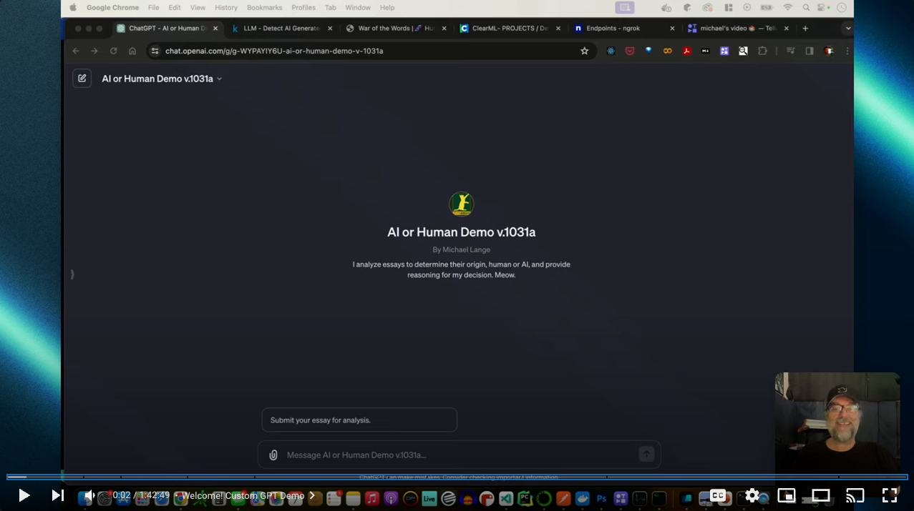

# Configure your Custom GPT

## &#8592;[Back](../README.md)


### All files needed are in the [GPT](../GPT) folder. 

### Follow along

[](https://youtu.be/fv-MYQ5fVNc)

### Ai or Human Logo


### Swagger
```yaml
openapi: 3.0.0
info:
  title: AI or LLM API
  version: 1.0.0
  description: Called a model to predict if the text was written by an LLM or a Human. Return analyses as well. 
    extract features.
servers:
  - url: https://9e3a-173-31-239-51.ngrok-free.app/serve
    description: Local development server
paths:
  /bert_infer_demo: 
    post:
      summary: Analyze text and generate predictions and features
      operationId: bert_infer_demo
      requestBody:
        description: Text to be analyzed
        required: true
        content:
          application/json:
            schema:
              type: object
              properties:
                text:
                  type: string
                  description: Text content to analyze
              required:
                - text
            example:
              text: Sample text to analyze.
      responses:
        "200":
          description: Successful response with analysis results
          content:
            application/json:
              schema:
                type: object
                properties:
                  bert_predictions:
                    type: array
                    items:
                      type: integer
                    description: Predictions from the BERT-based model
                  features:
                    type: object
                    additionalProperties:
                      type: number
                    description: Extracted features from the text
              example:
                bert_predictions:
                  - 1
                features:
                  flesch_kincaid_grade: 8.2
                  semantic_density: 0.5
                  ...: null
        "400":
          description: Bad request when the input text is not provided
        "500":
          description: Internal server error for any unhandled exceptions
```

### [Knowledge File](../GPT/knowledge.md) &#8594;