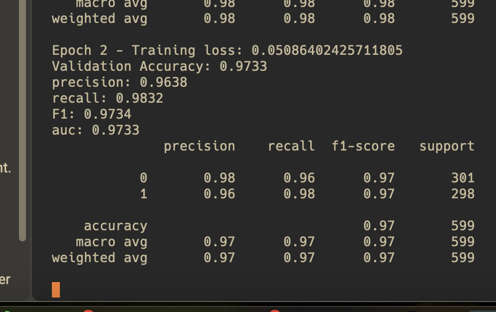
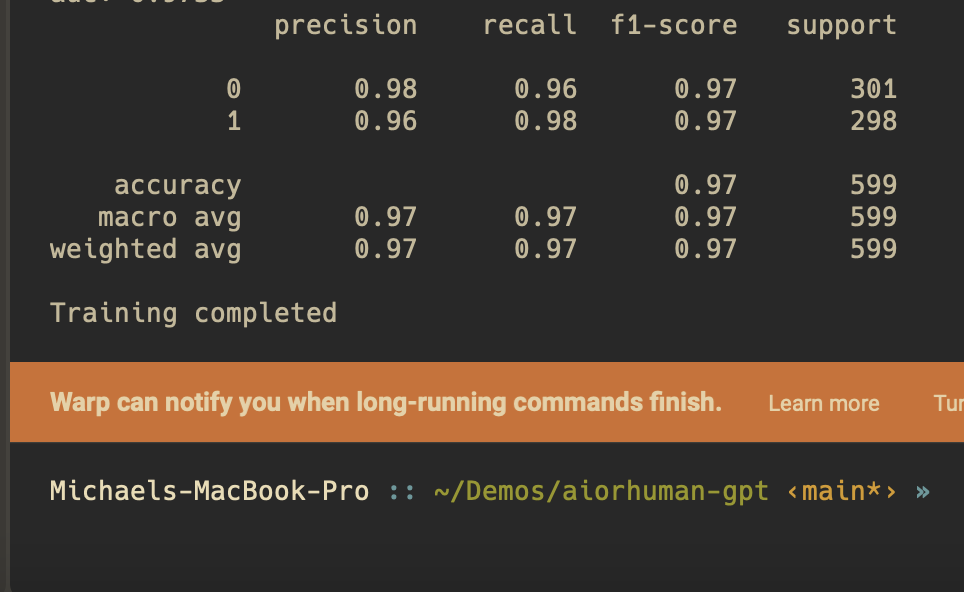

## Train and Publish Model
 

### Model Review
If we look at this code here

```python
# Connect your task with your argparse parameters
args = parse_args()
# Initialize ClearML task
task = Task.init(project_name=CFG.CLEARML_PROJECT_NAME, task_name=CFG.CLEARML_TASK_NAME, output_uri=True)
task.connect(vars(args))
```

### Publish Model
```python
# Script and save the model using the example inputs
model_path = 'bert_bilstm_model.pt'
torch.save(model.state_dict(), model_path)

output_model = OutputModel(task=task)
output_model.update_weights(model_path)
task.close()

# Log the scripted model in ClearML (if needed)
output_model = OutputModel(task=task)
output_model.update_weights(model_path)
```
We can see that we are saving the model and then logging it to ClearML. This runs and you have a model. Move on. It's a good idea to create tests. Manual adjustments may need to be made. Update the configs to point to your training files. NOTE: > jit scripting did not work, may want to checkout later. 

### Install the requirements 
```bash
pip install -r ai-or-human-gpt/aiorhuman_model/requirements.txt 
```

### Train 
Now you can train your model. We are going to use the default params but you can add your arg pare commands. i.e --bert-model-name 'bert-base-cased' 
```bash
python ai-or-human-gpt/aiorhuman_model/bert_bilstm_model.py
```

> LAST 10%: this is where you would setup and use a clearml-agent to run these remotely. 
> LAST 10%: train all three models so we can build multi-model inference. 

### Review on clearml. 

### Be paitent. See you in a min. Check out the model in clearml 

When this is like this after 3 epocs, leave it alone. it's upoading your model to your artifacts. (cleqrml servers in this case)



Only after you get this can you continue. 
  (wait for your prompt)